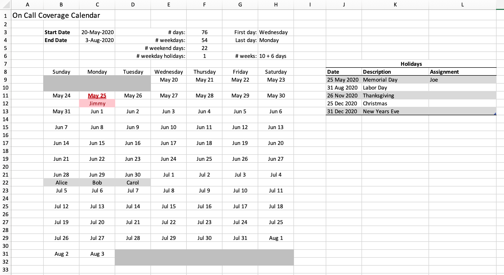
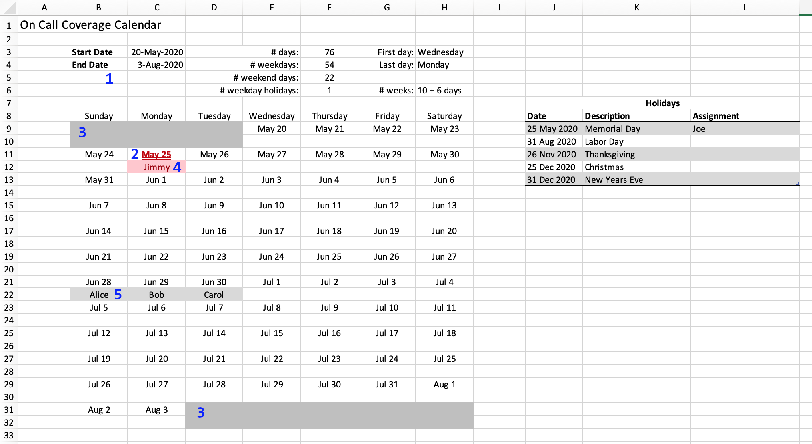
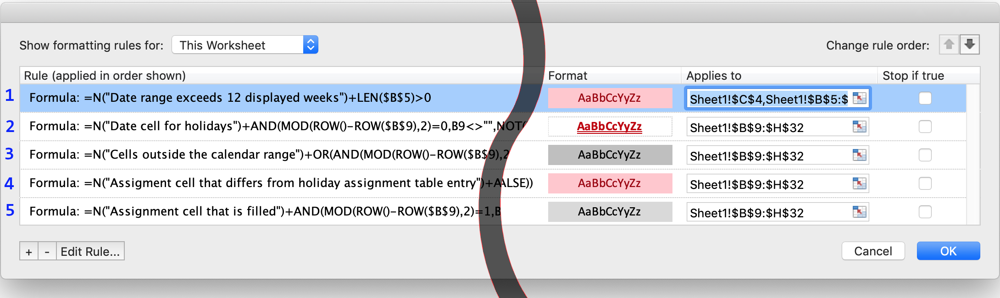

# on-call-calendar
Create on-call assignments in a calendar interface

## What it is

A tool to record on call assignments. The period of time is chosen by the user. Holidays can be marked and assigned in advance.

The spreadsheet is intended for you to apply any custom formatting you like. It looks like this, out of the box:

## Why use it

You have a pool of people who need to be on call, and you want to assign one person to cover each day. You also want to dole out assignments remotely but share the view of this calendar among all participants — perhaps via screen sharing or via a shared office.com file — so everyone can see the assignments as they are created.

## How to use

The date range shown on the calendar is customizable, up to 12 weeks in length. Enter the start date and the end date at the top in cells C3 and C4 and the calendar will be generated in the grid below. If you enter a date range that would extend beyond the 12-week display area a warning message will appear in cells B5:C5.

The top area of the spreadsheet shows statistics about the date range, such as number of weekdays and weekend/holiday days, so you can figure out how to distribute assignments fairly.

A table of holidays shows the holiday schedule, and allows holiday assignments to be made far in advance of the actual holiday dates. Conditional Formatting warns the user if an assignment is entered into the calendar that differs from the assignment set in the holiday schedule.

To assign a day to a person, enter that person's name in the cell immediately below the date. The cell's background color will change, to make it simple to distinguish from unassigned dates.

When you want to work on a new calendar range, be sure to clear all the assignments that are left over from the prior use. Excel's **Clear contents** menu item is helpful here.

## How to customize

Everything about the formatting can be customized to your liking — row heights, columns widths, cell formats, and conditional formatting — using all of Excel's formatting tools. Conditional formatting rules control several areas of the display, indicated in this image:

The conditional formatting rules are shown in this illustration below, with the annotated numbers referring to the areas on the image above:

Here is an example look that can be created using customized formats:

~[Customized formatting example](example-customization.png)